# built-in-code-analysis-project-templates-vsix

    A Visual Studio extension adding new project templates with built-in code analysis. 
    The extension is for Visual Studio 2022 and above. 
    This extension makes sure <a href="https://docs.microsoft.com/en-us/dotnet/fundamentals/code-analysis/overview#third-party-analyzers">recommended analyzers</a> are installed and enabled at all time. 
    <ul>
        <li>.NET analyzers</li>
        <li>SonarAnalyzer</li>
        <li>Roslynator (for C# projects only)</li>
        <li>FluentAssertions.Analyzers (for test projects only)</li>
        <li>xunit.analyzers (for test projects only)</li>
    </ul>

## Overview

<table>
	<tr>
		<td colspan="2" align="center">
			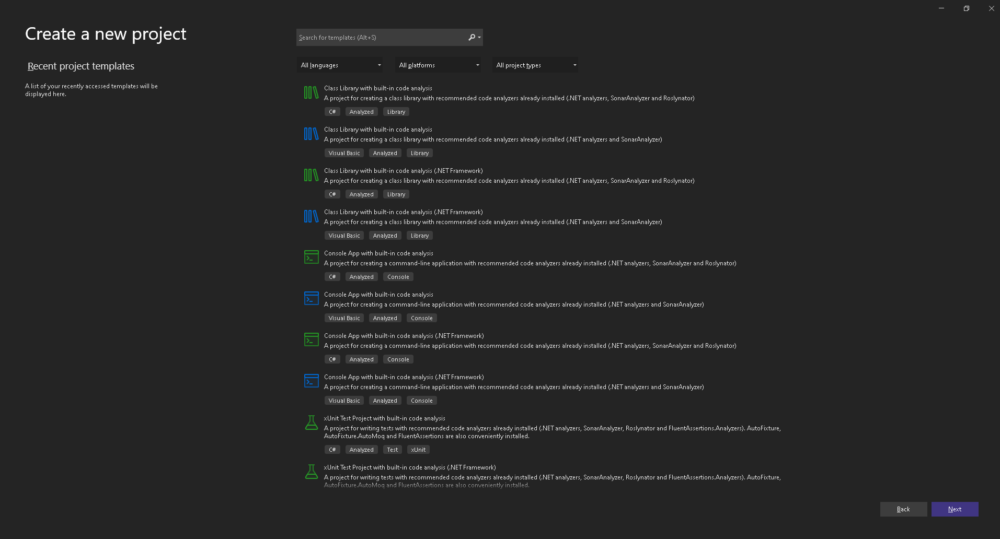
			
<i>Visual Studio New Project Dialog with the new templates</i>

			 
		</td>
	</tr>
	<tr>
		<td valign="center" align="center">
			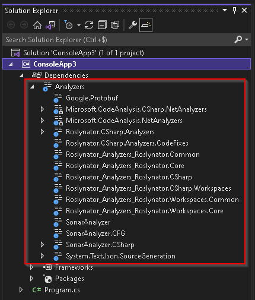
			
<i>C# Console Application</i>

			 
		</td>
		<td valign="center" align="center">
			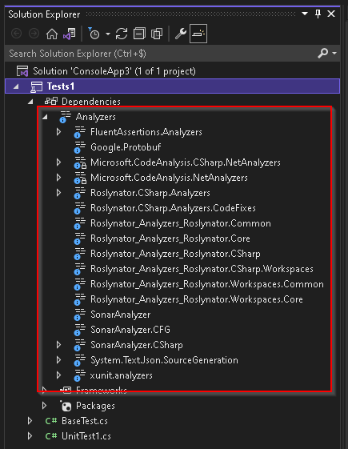
			
<i>C# xUnit Test Project</i>

			 
		</td>
	</tr>
	<tr>
		<td valign="center" align="center">
			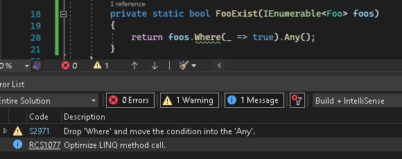
			
<i>Linq query optimization detected</i>

		</td>
		<td valign="center" align="center">
			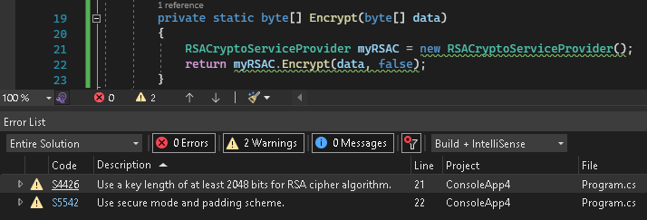
			
<i>Weak encryption algorithm detected</i>

		</td>
	</tr>
</table>

 

## List of project templates

| Language | Type          | Compatible Frameworks                            | Name                                                            | Included Analyzers                                                                     |
|:--------:|:-------------:|:------------------------------------------------:|:---------------------------------------------------------------:|:--------------------------------------------------------------------------------------:|
| C#       | Console App   | .NET Core 3.1, .NET 5, .NET 6                    | Console App with built-in code analysis                         | .Net analyzers, SonarAnalyzer, Roslynator                                              |
| C#       | Console App   | .NET Framework 4.6.2, 4.7, 4.7.1, 4.7.2, 4.8     | Console App with built-in code analysis (.NET Framework)        | .Net analyzers, SonarAnalyzer, Roslynator                                              |
|          |               |                                                  |                                                                 |                                                                                        |
| C#       | Class Library | .Net Standard 2.1, .NET Core 3.1, .NET 5, .NET 6 | Class Library with built-in code analysis                       | .Net analyzers, SonarAnalyzer, Roslynator                                              |
| C#       | Class Library | .NET Framework 4.6.2, 4.7, 4.7.1, 4.7.2, 4.8     | Class Library with built-in code analysis (.NET Framework)      | .Net analyzers, SonarAnalyzer, Roslynator                                              |
|          |               |                                                  |                                                                 |                                                                                        |
| C#       | Test/xUnit    | .NET Core 3.1, .NET 5, .NET 6                    | xUnit Test Project with built-in code analysis                  | .Net analyzers, SonarAnalyzer, Roslynator, xunit.analyzers, FluentAssertions.Analyzers |
| C#       | Test/xUnit    | .NET Framework 4.6.2, 4.7, 4.7.1, 4.7.2, 4.8     | xUnit Test Project with built-in code analysis (.NET Framework) | .Net analyzers, SonarAnalyzer, Roslynator, xunit.analyzers, FluentAssertions.Analyzers |
|          |               |                                                  |                                                                 |                                                                                        |
| VB       | Console App   | .NET Core 3.1, .NET 5, .NET 6                    | Console App with built-in code analysis                         | .Net analyzers, SonarAnalyzer                                                          |
| VB       | Console App   | .NET Framework 4.6.2, 4.7, 4.7.1, 4.7.2, 4.8     | Console App with built-in code analysis (.NET Framework)        | .Net analyzers, SonarAnalyzer                                                          |
|          |               |                                                  |                                                                 |                                                                                        |
| VB       | Class Library | .Net Standard 2.1, .NET Core 3.1, .NET 5, .NET 6 | Class Library with built-in code analysis                       | .Net analyzers, SonarAnalyzer                                                          |
| VB       | Class Library | .NET Framework 4.6.2, 4.7, 4.7.1, 4.7.2, 4.8     | Class Library with built-in code analysis (.NET Framework)      | .Net analyzers, SonarAnalyzer                                                          |

 

## Pros of using analyzers

* Write compliant code
  * More secure (will detect weak hash algorithms, hard-coded sensitive stuff, etc.)
  * More optimized (will detect and autofix slow database queries, etc.)
  * Less error prone (will detect code smells, dead code, etc.)
* Happens during development phase (fixes code as soon as possible)
* Friendlier pull request (code already cleaned and optimized)
* CI will complain less (code already compliant)

 

## Installation guide

1. Download <a href="https://github.com/s8Usy429/built-in-code-analysis-vs-project-templates-extension/releases/latest">the latest release</a>: 
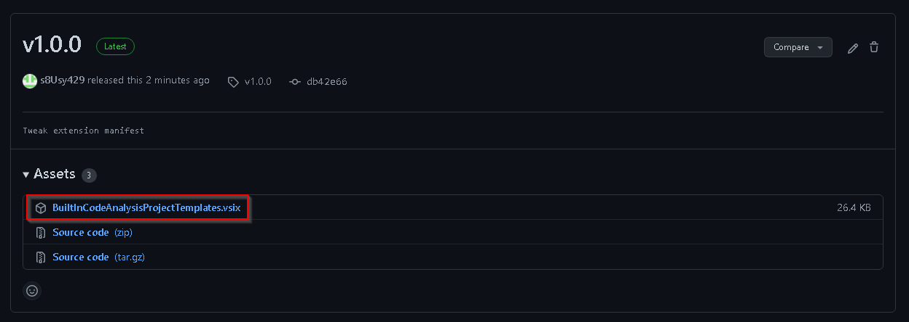

2. Launch the installer: 
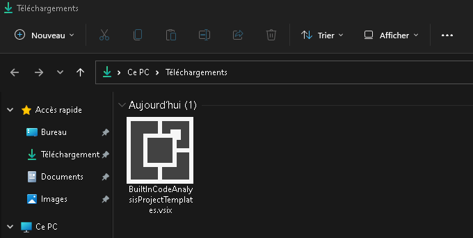

3. Select at least one target Visual Studio version where the extension should be installed: 
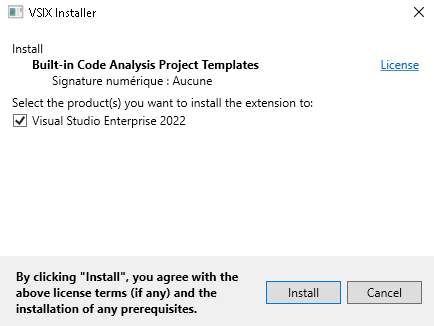

4. Close Visual Studio instances if the installer complains about it.

5. That's it. You can check the extension has been installed successfuly from Visual Studio extension window: 
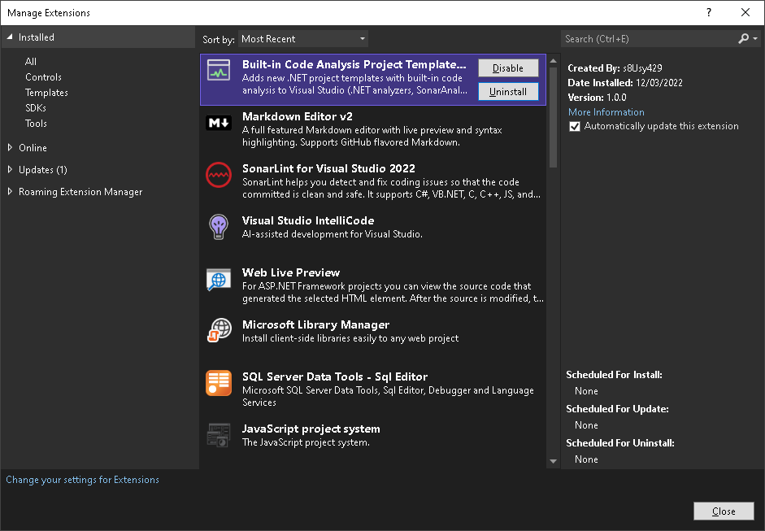

 

## Usage

1. Open Visual Studio "Create a new project" window.

2. All the new projects will show up at the top (it will until you use them).

3. At anytime, you can filter the list of projects on the "Analyzed" project type. 
This, will show only projects added by this extension 
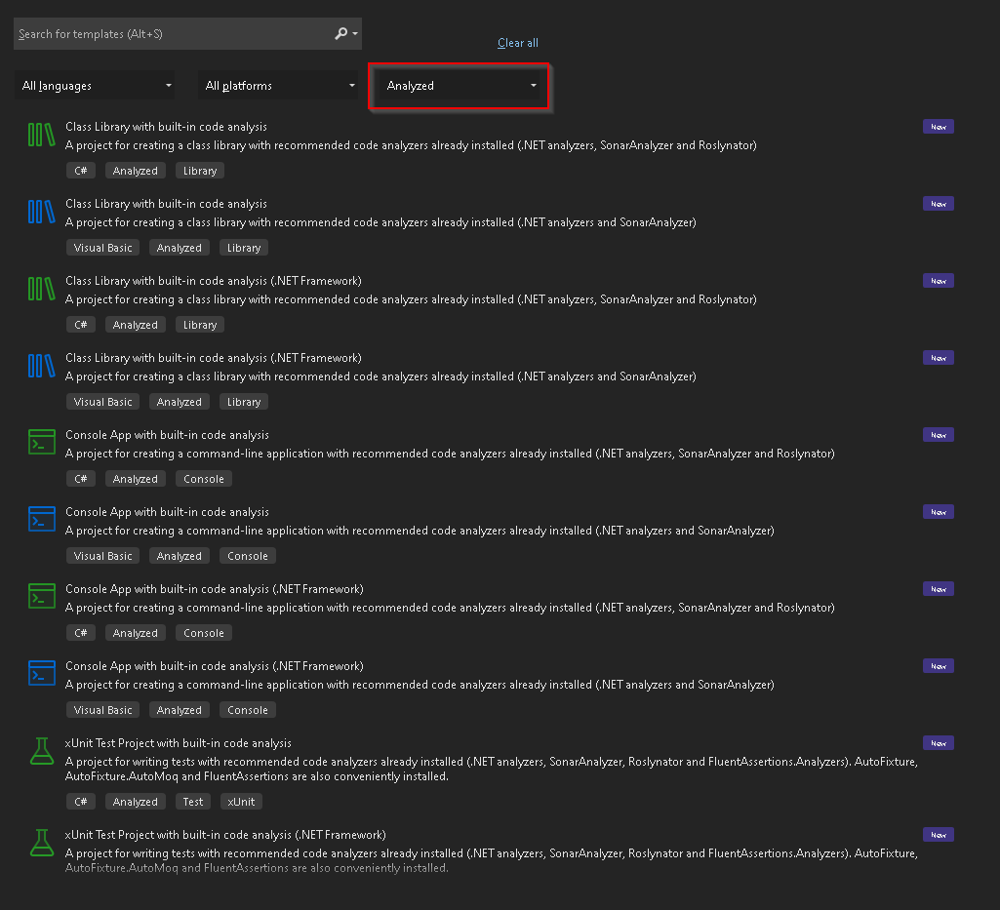

4. Let us create an instance of "xUnit Test Project with built-in code analysis":

5. Wait for Visual Studio to restore nuget packages, or trigger it yourself.

6. Visual Studio 2022 conveniently shows the list of installed analyzers from the "Solution Explorer" window: 
  
Notice, the extension has installed the following analyzers:
   * FluentAssertions.Analyzers (assuming you are going to use FluentAssertions which is also installed by this extension)
   * .Net Analyzers
   * Roslynator
   * SonarAnalyzer
   * (xunit.analyzers is now already included when installing xunit. This is not included by this extension.)

7. If you are curious, you can see the list of all the rules for each analyzer: 
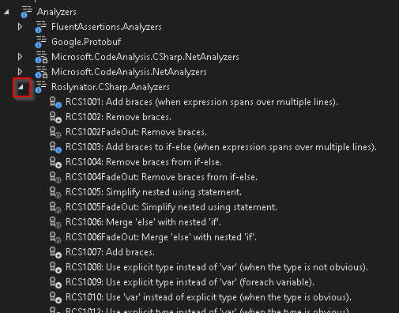

8. Enjoy coding easier !

 

## Developper guide

Actually, the extension just provides a way to deploy the project templates. 
It is an empty extension (no code) and just references a local nuget package which does contain the project templates. 
The reason it is done like this is because the templates have nothing to do with Visual Studio. They are "dotnet new XXX" style projects. 
Actually you can achieve this if you go an install the local nuget package like this: 
<code># Create the nuget package</code> 
<code>dotnet pack templates/_ignore.csproj -o templates</code> 
<code># Install the nuget package to work with dotnet CLI</code> 
<code>dotnet new --install templates/ProjectsWithAnalyers.Templates.1.0.0.nupkg</code> 
<code># Verify installed templates</code> 
<code>dotnet new -l # the output will contain the templates shiped inside the nuget package</code> 
<code># How to uninstall</code> 
<code>dotnet new --uninstall templates/ProjectsWithAnalyers.Templates.1.0.0.nupkg</code>

Using the extension basically does all that without impacting your dotnet CLI installation though (templates won't show up in <code>dotnet new -l</code>). 
To make sure the extension is always deploying the latest version of the nuget package, the extension recreates the package using the following pre-build event: 
<code>dotnet pack "\$(SolutionDir)templates\_ignore.csproj" -o "\$(SolutionDir)templates"</code> 
<code>RD /S /Q "\$(SolutionDir)templates\bin"</code> 
<code>RD /S /Q "\$(SolutionDir)templates\obj"</code> 

 

### Build and run the extension:

1. Install the extensibility module from Visual Studio Installer:
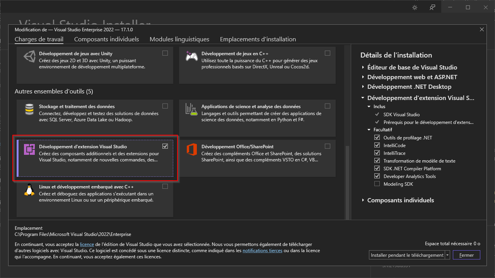

2. Install the "Extensibility Essentials 2022" extension from Visual Studio managment window:
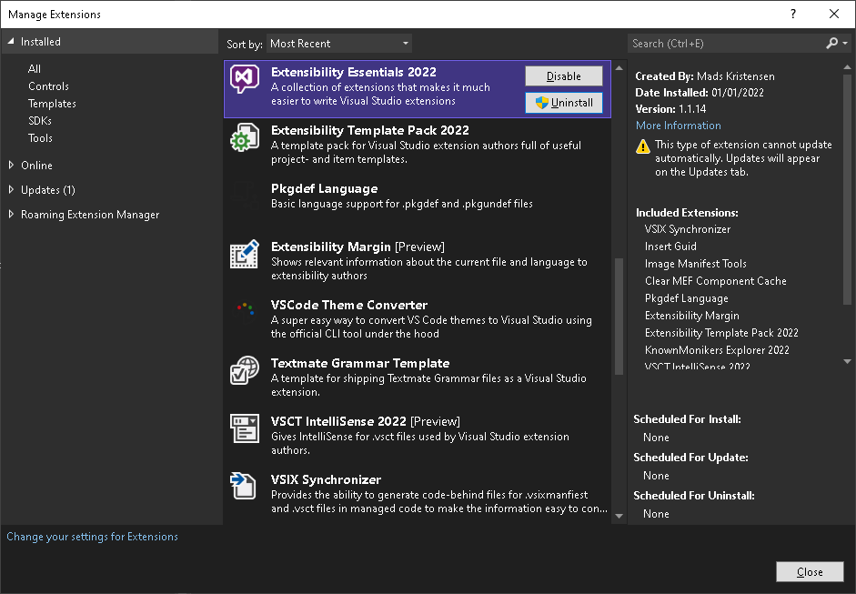

3. Open the solution within Visual Studio, build and run. 
Visual Studio will start an experimental instance of Visual Studio with the extension installed.

4. Within the newly started experimental instance, navigate to the "Create new project" window. The project templates will show up.

 

### Understand how the templates are packed
All the templates are located within the "templates" folder: 
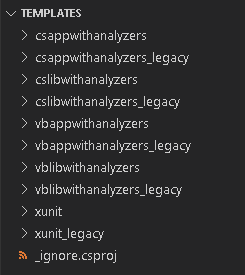 
The "_ignore.csproj" is a fake project just to be able to use the <code>dotnet pack</code> command. 
The <code>dotnet pack</code> command currently requires a project to create a nuget package. Microsoft is working on it, but it is not there yet. 
The nuget simply contains the file like a zip archive would do. There is no C#/VB code whatsoever. Just raw files packed in. 
The extension creates the package on build using the following pre-build event: 
<code>dotnet pack "\$(SolutionDir)templates\_ignore.csproj" -o "\$(SolutionDir)templates"</code> 
<code>RD /S /Q "\$(SolutionDir)templates\bin"</code> 
<code>RD /S /Q "\$(SolutionDir)templates\obj"</code> 

 

### What's inside template folders ?

<table>
	<tr>
		<td valign="center" align="center">
			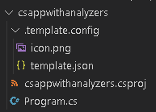
			
<i>C# Console Application</i>

			 
		</td>
		<td valign="center" align="center">
			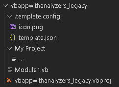
			
<i>VB legacy Console Application</i>

			 
		</td>
	</tr>
</table>

| Item                             | Name can be changed | Description                                                                                                                                                   |
|----------------------------------|:-------------------:|---------------------------------------------------------------------------------------------------------------------------------------------------------------|
| .template.config                 | No                  | A folder that contains the template configuration                                                                                                             |
| icon.png                         | No                  | (Optional) The icon the template will display within "Visual Studio New Project Dialog" window. If not set, Visual Studio provides a default icon anyway. |
| template.json                    | No                  | The configuration of the template.                                                                                                                            | 
| csappwithanalyzers.csproj        | Yes                 | A file that will be created when creating an instance of the template. Could be any file.                                                                     |
| Program.cs                       | Yes                 | A file that will be created when creating an instance of the template. Could be any file.                                                                     |
|                                  |                     |                                                                                                                                                               |
| My Project                       | Yes                 | A folder that will be created when creating an instance of the template. Could be any folder.                                                                 |
| -.-                              | No                  | An empty file ignored by the template engine when we need to create an empty folder. This file won't be created when creating an instance of the template.    |
| Module1.vb                       | Yes                 | A file that will be created when creating an instance of the template. Could be any file.                                                                     |
| vbappwithanalyzers_legacy.csproj | Yes                 | A file that will be created when creating an instance of the template. Could be any file.                                                                     |

 

### Learn more about dotnet template engine
<a href="https://github.com/dotnet/templating/wiki">Home for the .NET Core Template Engine</a> 
<a href="https://github.com/sayedihashimi/template-sample">sayedihashimi sample repository</a>

 

## Miscellaneous/Troubleshooting 

This extension will only work on VS2022 and above !!! The installer won't let you install it on VS2019 anyway.

There is no plan to add a template for creating xUnit tests using VB. Turns out you can just use a C# xUnit test project to test VB stuff.
